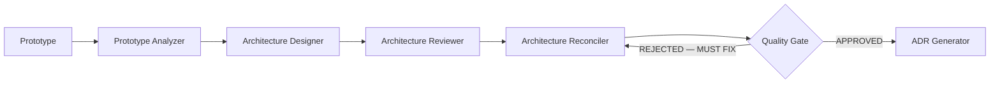
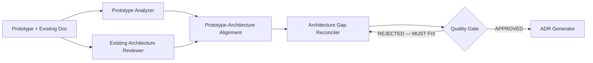
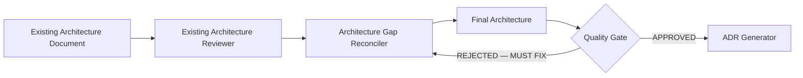
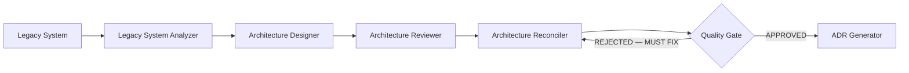
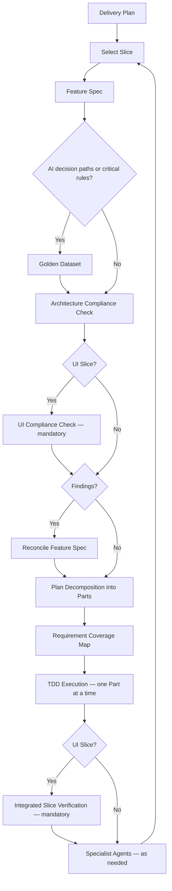

# AI Architecture Toolkit

[](VERSION.md)
[](LICENSE)

A structured, AI-assisted workflow for going from **prototype to production** — covering architecture design, review, delivery planning, decomposition, and TDD execution.

[Overview](#overview) · [Prerequisites](#prerequisites) · [Quick Start](#quick-start) · [Getting Started](#getting-started) · [Workflow](#workflow) · [What's Included](#whats-included) · [Instruction Files](#instruction-files-for-ai-agents) · [Usage](#usage) · [Repository Strategy](#repository-strategy) · [Guides & Examples](#guides--examples) · [Key Concepts](#key-concepts) · [Contributing](#contributing) · [License](#license)

## Overview

This toolkit provides prompts, agents, templates, workflows, and guides that support a disciplined software delivery process, from early prototyping through production-grade implementation.

It is designed for teams and individuals who:

- Build exploratory prototypes and want to extract validated architecture from them
- Need a repeatable process for architecture design, review, and reconciliation
- Want structured delivery planning with vertical slices and feature specs
- Use TDD-based execution with AI-assisted decomposition
- Rely on specialist AI agents for backend, frontend, QA, DevOps, and more

> [!NOTE]
> This toolkit is workflow-driven. It does not generate code directly — it provides the structured prompts, templates, and guidance that AI coding agents consume to produce consistent, architecture-aware outputs.

## Prerequisites

You need an AI coding agent such as GitHub Copilot, Claude, Cursor, or any LLM-based assistant that can read files from your repository. The toolkit provides the prompts and structure — your AI agent performs the generation and implementation work.

## Quick Start

> **New to the toolkit?** Read the [Quick-Start Guide](ai/guides/quick-start.md) for a guided walkthrough that takes you from zero to your first vertical slice in 15 minutes. See the [Toolkit Map](ai/guides/toolkit-map.md) for a visual overview of all toolkit components.

The shortest path from prototype to implementation. Each step means prompting your AI agent with the referenced prompt file and writing the output to the indicated path.

1. Fill in project context using `ai/templates/project-context-template.md`
2. Prompt with `ai/prompts/prototype-analyzer.md` → `architecture/prototype-analysis.md`
3. Prompt with `ai/prompts/architecture-designer.md` → `architecture/architecture-blueprint.md`
4. Prompt with `ai/prompts/architecture-reviewer.md` → `architecture/review-report.md`
5. Prompt with `ai/prompts/architecture-reconciler.md` → `architecture/architecture-final.md`
6. In a fresh session, prompt with `ai/prompts/architecture-final-quality-gate.md` → `architecture/architecture-final-gate.md`; on `REJECTED — MUST FIX`, return to step 5 — continue only on `APPROVED` or `APPROVED WITH NOTES`
7. Prompt with `ai/prompts/adr-generator.md` → `architecture/adr/*.md`
8. Prompt with `ai/prompts/delivery-planner.md` → `architecture/delivery-plan.md`
9. Prompt with `ai/prompts/feature-spec-generator.md` → `architecture/feature-specs/<slice-id>-<slice-name>.md`
10. Use `.github/skills/plan-decomposer` → `ai-parts/<slice-id>/OVERVIEW.md` and `ai-parts/<slice-id>/PXX-*.md`; the overview must map every feature-spec criterion to an owning Part
11. Use `.github/skills/part-executor-tdd` → execute one Part at a time with strict TDD; capture the review snapshot, §3b requirement matrix, and applicable mutation evidence, then complete the twelve-check Step 6a review before the next Part starts

Implementation begins at **step 11**, after you have both the selected slice
feature spec and `ai-parts/<slice-id>/OVERVIEW.md` plus the specific
`ai-parts/<slice-id>/PXX-*.md` Part. The delivery plan is the roadmap; the Part
files are the execution-ready handoff.

Each Part Quality Report is a traceability artifact, not just a checklist: its
§3b matrix links every criterion to implementation, a positive test, a
negative/edge test, verification evidence, and Part ownership. Step 6a then
freezes the diff and audits all twelve checks, including D1–D9 dimensions and
requirement coverage. A rejected Part remains in progress until remediation is
recorded and a fresh review approves it.

> [!NOTE]
> Output files (e.g. `architecture/prototype-analysis.md`) are generated by running the prompts — they will not exist until you complete each step.

> [!TIP]
> If you are unsure where to start, run the first three prompts for your entry mode (see [Getting Started](#getting-started)). That will get you oriented quickly.

> [!TIP]
> Looking for the approved plan or the current execution target? Start with
> `architecture/delivery-plan.md`, then move to
> `architecture/feature-specs/<slice-id>-<slice-name>.md`, then
> `ai-parts/<slice-id>/OVERVIEW.md`, and finally the specific
> `ai-parts/<slice-id>/PXX-*.md` Part you are executing.

## Getting Started

### 1. Choose your entry mode

Your starting point depends on what you already have:

| Mode | You have | Workflow |
|------|----------|----------|
| **A — Prototype Only** | A working prototype, no architecture doc | `ai/workflows/architecture-workflow-prototype-only.md` |
| **B — Prototype + Architecture Doc** | Both a prototype and an existing architecture document | `ai/workflows/architecture-workflow-prototype-plus-architecture-doc.md` |
| **C — Architecture Doc Only** | An architecture document, no prototype | `ai/workflows/architecture-workflow-architecture-doc-only.md` |
| **D — Legacy System Replacement** | A legacy system you want to replace with a new system, not repair | `ai/workflows/architecture-workflow-legacy-system-replacement.md` |

Choose the mode based on the strongest available input. If you have an architecture document but are unsure whether it is trustworthy, use Mode B and validate it rather than assuming it is correct. If your only usable input is a legacy system that you want to replace, use Mode D.

See `ai/guides/how-to-choose-entry-mode.md` for details. `ai/workflows/architecture-workflow.md` is the mode selector — all four modes converge on the same finalization gate: `architecture/architecture-final.md` with an `APPROVED` or `APPROVED WITH NOTES` verdict from the architecture-final quality gate (`ai/prompts/architecture-final-quality-gate.md` → `architecture/architecture-final-gate.md`), plus ADRs.

### 2. Fill in project context

Copy `ai/templates/project-context-template.md` to `ai/project-context.md` and fill it in for your project.

### 3. Follow the workflow

Each entry mode guides you through architecture analysis, review, reconciliation, ADR generation, and delivery planning. Once a delivery plan exists, switch to the **engineering workflow** for implementation.

## Workflow

### Architecture phase

Each entry mode follows a different path to produce the authoritative architecture:

<details>
<summary><b>Mode A — Prototype Only</b></summary>



</details>

<details>
<summary><b>Mode B — Prototype + Existing Architecture Document</b></summary>



</details>

<details>
<summary><b>Mode C — Architecture Document Only</b></summary>



</details>

<details>
<summary><b>Mode D — Legacy System Replacement</b></summary>



</details>

### Delivery and execution phase

Once the architecture is finalized, all modes converge into the same delivery and execution loop driven by `ai/workflows/engineering-workflow.md`:



Feature specs are not optional documentation. When a feature spec exists for the selected slice, it is the primary input that guides decomposition — more precisely than the broader delivery plan.

To prepare one slice end-to-end (selection through decomposition) in a single agent run, use `ai/prompts/slice-preparation-runner.md`.

## What's Included

### Prompts — `ai/prompts/`

Structured prompts for each workflow step:

| Prompt | Purpose |
|--------|---------|
| `prototype-analyzer` | Extract behavior and intent from a prototype |
| `legacy-system-analyzer` | Extract business intent, workflows, and constraints from a legacy system being replaced |
| `architecture-designer` | Design production architecture |
| `architecture-reviewer` | Review architecture for risks and gaps |
| `architecture-reconciler` | Reconcile reviewer feedback into a final architecture |
| `architecture-gap-reconciler` | Reconcile gaps when starting from an existing doc |
| `architecture-final-quality-gate` | Quality gate on `architecture-final.md` (fresh session, before ADR generation) — verdict `APPROVED` / `APPROVED WITH NOTES` / `REJECTED — MUST FIX` |
| `existing-architecture-reviewer` | Review a pre-existing architecture document |
| `prototype-architecture-alignment` | Align prototype behavior with architecture doc |
| `adr-generator` | Generate Architecture Decision Records |
| `delivery-planner` | Create a milestone-based delivery plan with vertical slices |
| `feature-spec-generator` | Generate detailed specs for individual slices |
| `feature-spec-reconciler` | Reconcile feature spec feedback |
| `feature-spec-reconciler-quickversion` | Lightweight feature spec reconciliation for smaller changes |
| `architecture-compliance` | Verify implementation aligns with approved architecture |
| `slice-preparation-runner` | Run engineering workflow Steps 2–5 for one slice in a single agent session, stopping before execution |
| `golden-dataset-generator` | Generate test datasets for AI/business logic validation |
| `design-system-generator` | Generate a design system v1 for greenfield UI projects |
| `design-system-from-inventory` | Derive a design system from an existing UI inventory |
| `ui-inventory` | Inventory existing UI surfaces, components, and tokens |
| `ui-compliance-check` | Verify UI implementation conforms to the design system |
| `code-quality-reviewer` | Per-Part twelve-check review with D1–D9 dimension and requirement coverage audits (engineering workflow Step 6a) |
| `toolkit-sync-upgrade` | Upgrade a project repo's embedded toolkit copy to a newer toolkit version |

### Agents — `ai/agents/`

Specialist AI agents for different concerns:

| Agent | Focus |
|-------|-------|
| `orchestrator-agent` | Coordinates the overall workflow |
| `backend-agent` | Backend implementation |
| `frontend-agent` | Frontend implementation |
| `ai-agent` | AI/ML model integration |
| `qa-agent` | Quality assurance |
| `ai-testing-agent` | AI-specific testing and golden datasets |
| `devops-agent` | CI/CD, infrastructure, deployment |
| `code-reviewer-agent` | Per-Part twelve-check review (engineering workflow Step 6a) |
| `integration-reviewer` | Cross-boundary integration review |

Copilot-format personas (with VS Code tool manifests) live in `.github/agents/`: `expert-dotnet-software-engineer`, `backend-agent`, and `devops-docker-traefik`.

### Skills — `.github/skills/`

Execution-layer skills that bridge planning and code implementation:

| Skill | Purpose |
|-------|---------|
| `plan-decomposer` | Decomposes a selected slice, guided primarily by its feature spec, into independently verifiable Parts under `ai-parts/<slice-id>/` |
| `part-executor-tdd` | Executes one Part at a time using strict red-green-refactor TDD |

### Templates — `ai/templates/`

Reusable templates for structured output:

- **Architecture blueprint** — `architecture-blueprint-template.md`
- **ADR** — `adr-template.md`
- **Feature spec** — `feature-spec-template.md`
- **Compliance report** — `compliance-report-template.md`
- **Golden dataset** — `golden-dataset-template.md` / `golden-dataset-json-template.json`
- **Project context** — `project-context-template.md`
- **Project CLAUDE.md** — `project-claude-template.md`
- **Design system** — `design-system-template.md`
- **UI inventory** — `ui-inventory-template.md`
- **Retrofit spec** — `retrofit-spec-template.md`
- **Slice verification checklist** — `slice-verification-checklist-template.md` (criterion rollup and browser evidence)
- **Part Quality Report** — `code-quality-checklist-template.md` (snapshot, §3b matrix, mutation evidence, and quality gates)
- **Remediation spec** — `remediation-spec-template.md`

### Workflows — `ai/workflows/`

End-to-end process definitions:

- `architecture-workflow.md` — Mode selector and finalization gate for the architecture phase
- `architecture-workflow-prototype-only.md` — Mode A
- `architecture-workflow-prototype-plus-architecture-doc.md` — Mode B
- `architecture-workflow-architecture-doc-only.md` — Mode C
- `architecture-workflow-legacy-system-replacement.md` — Mode D
- `engineering-workflow.md` — Slice-based implementation with TDD (canonical step numbering)
- `ui-foundation-workflow.md` — Greenfield UI — create design system before delivery planning
- `ui-retrofit-workflow.md` — Retrofit UI — inventory, derive design system, migrate existing slices
- `ui-remediation-workflow.md` — Revalidate and fix slices completed without browser-based UI verification

### Architecture outputs — `architecture/`

Per-project outputs generated by running the toolkit. In this source repository the directory contains **scaffold placeholders** showing each output's expected shape — they become real documents only in your project repo:

- `architecture-final.md` — Authoritative architecture (source of truth)
- `architecture-final-gate.md` — Quality gate verdict for `architecture-final.md`
- `design-system.md` — Design system (authoritative for UI decisions, when present)
- `ui-inventory.md` — UI inventory (retrofit track input)
- `adr/` — Architecture Decision Records
- `delivery-plan.md` — Milestone and slice plan
- `feature-specs/` — Per-slice feature specifications
- `compliance-reports/` — Architecture and UI compliance reports per slice
- `slice-verification/` — Integrated Slice Verification evidence per slice
- `golden-datasets/` — Test datasets for validation

### MCP server — `mcp-server/`

A .NET [Model Context Protocol](https://modelcontextprotocol.io/) server that exposes the toolkit to LLM-powered environments: toolkit content as resources (`toolkit://…`), project artifacts as resources (`project://…`), and tools such as `get_workflow_context`, `get_slice_context`, and `check_verticality`. See `mcp-server/README.md`. Using it is optional — the toolkit works with plain file access.

## Instruction Files for AI Agents

The toolkit uses layered instruction files. They must stay consistent with each other:

| File | Role | Consumed by |
|------|------|-------------|
| `CLAUDE.md` (root) | Primary instruction file for Claude and compatible agents: repository purpose, working rules, entry modes, workflow sequence, maintenance rules | Claude Code, Cursor, and any agent that reads `CLAUDE.md` |
| `.github/copilot-instructions.md` | Canonical numbered working rules, cross-tool | GitHub Copilot (and mirrored into `CLAUDE.md`) |
| `ai/CLAUDE.md` | Directory-scoped notes for editing toolkit assets under `ai/` | Claude Code |
| `.github/instructions/*.instructions.md` | File-type coding conventions (C#, Dockerfile, Compose) | All agents writing code |
| `ai/templates/project-claude-template.md` | Starting point for the `CLAUDE.md` you place in a **project** repo | You, when adopting the toolkit |

When you copy the toolkit into a project, copy `.github/copilot-instructions.md` as-is and create the project's `CLAUDE.md` from `ai/templates/project-claude-template.md` (see [Repository Strategy](#repository-strategy)).

## Usage

### Using with Copilot

Copilot works best when instructions and architecture files live inside the repo. Use `.github/copilot-instructions.md` to point Copilot at:

- `architecture/architecture-final.md` and `architecture/adr/*.md` as authoritative sources
- Workflows in `ai/workflows/`
- Vertical slice, modular monolith, and TDD expectations

Example prompts:

```text
Follow ai/workflows/engineering-workflow.md.
Use architecture/delivery-plan.md as input.
```

```text
Use ai/agents/backend-agent.md
and implement the backend tasks for the current slice.
```

### Using with Claude, Cursor, or other AI coding agents

Place the toolkit inside or alongside your project repository, make sure the project `CLAUDE.md` exists (from `ai/templates/project-claude-template.md`), then prompt step by step:

```text
Use ai/prompts/prototype-analyzer.md.
Analyze this repository as a prototype.
Treat it as reference behavior, not reference architecture.
Write the result to architecture/prototype-analysis.md.
```

```text
Use ai/prompts/architecture-designer.md
and ai/templates/architecture-blueprint-template.md.
Generate architecture/architecture-blueprint.md.
```

Continue through the workflow steps. For execution, use:

```text
Use .github/skills/plan-decomposer/SKILL.md.
Inputs: architecture/delivery-plan.md and architecture/feature-specs/<slice-id>-<slice-name>.md
Output: ai-parts/<slice-id>/OVERVIEW.md and ai-parts/<slice-id>/PXX-*.md
```

```text
Use .github/skills/part-executor-tdd/SKILL.md.
Execute exactly one Part from ai-parts/<slice-id>/.
Follow strict TDD and ai/guides/code-quality-standard.md.
End with the Part Quality Report (ai-parts/<slice-id>/reviews/<part-id>-quality-report.md).
```

After each Part, run the review — **mandatory, and in a fresh session/subagent** (never the session that executed the Part):

```text
Use ai/prompts/code-quality-reviewer.md.
Review the executed Part <part-id> of slice <slice-id> against its quality report and diff.
Output: ai-parts/<slice-id>/reviews/<part-id>-review.md with a verdict.
```

When needed, ask the agent to adopt a specialist role:

```text
Use ai/agents/backend-agent.md.
Implement the backend tasks for the current slice.
```

## Repository Strategy

The toolkit supports two deployment models.

### Option A — Toolkit inside the project repo

Place the full toolkit in your project repository. Simplest setup for a single project.

```text
project-repo/
├── CLAUDE.md              (from ai/templates/project-claude-template.md)
├── ai/
├── architecture/
├── ai-parts/
├── .github/
│   ├── skills/
│   ├── agents/
│   ├── instructions/
│   └── copilot-instructions.md
├── src/
└── tests/
```

### Option B — Central toolkit repo + per-project repos (recommended)

Keep the master toolkit centrally and maintain one version of prompts, templates, and workflows. Each project repo keeps only its generated outputs and project-specific context. This avoids prompt duplication while keeping project architecture artifacts local.

**Central toolkit repo:**

```text
ai-architecture-toolkit/
├── CLAUDE.md    (toolkit-repo instructions)
├── ai/          (prompts, templates, workflows, agents, guides, examples)
├── .github/     (skills, agents, instructions)
├── mcp-server/  (optional MCP server)
└── README.md
```

**Per-project repo (minimal):**

```text
project-repo/
├── CLAUDE.md              (from ai/templates/project-claude-template.md)
├── architecture/          (generated outputs, ADRs, feature specs, compliance reports, verification evidence, golden datasets)
├── ai/project-context.md  (project-specific context)
├── .github/copilot-instructions.md
├── ai-parts/              (decomposition output, one folder per slice)
├── src/
└── tests/
```

Record in the project's `CLAUDE.md` which toolkit version (see `VERSION.md`) the project was copied from. Keep local overrides in a project repo only when the project needs domain-specific prompt variations, special compliance requirements, or version traceability of exactly which prompt version was used.

## Guides & Examples

### Guides — `ai/guides/`

| Guide | Description |
|-------|-------------|
| `quick-start.md` | Guided walkthrough — zero to first vertical slice in 15 minutes |
| `toolkit-map.md` | Visual map of all toolkit components organized by phase |
| `glossary.md` | Definitions of all load-bearing terms (slice, part, phase, contract, etc.) |
| `vertical-slice-definition.md` | What constitutes a vertical slice, the verticality test, and anti-patterns |
| `modular-monolith-definition.md` | Modular monolith pattern and when to use it |
| `contract-definition.md` | API contract structure and testing guidance |
| `how-to-choose-entry-mode.md` | Decision guide for which workflow to use |
| `how-feature-specs-are-used.md` | How feature specs bridge planning and implementation |
| `definition-of-ready-and-done.md` | Readiness and completion criteria |
| `code-quality-standard.md` | Implementation-quality rules enforced per Part (read-before-write, pattern precedence, contract surfaces, test quality) |
| `operating-model.md` | Full operating model across all phases |
| `ai-explainability-guide.md` | Explainability tiers, patterns, storage, and testing |
| `ai-governance-checklist.md` | Governance checklist for AI features |

Historical design rationale (the decisions that shaped the toolkit) lives in [docs/design-history.md](docs/design-history.md).

### UI Design System

The toolkit supports two UI tracks for projects with human-facing interfaces:

| Track | When to Use | Workflow |
|-------|-------------|----------|
| **Greenfield** | New project — create design system from architecture | `ai/workflows/ui-foundation-workflow.md` |
| **Retrofit** | Existing project — derive design system from current UI | `ai/workflows/ui-retrofit-workflow.md` |

Both tracks produce `architecture/design-system.md`, which becomes authoritative for UI decisions. Projects without UI can skip both tracks entirely — all UI-related steps are conditional on the project type.

For projects that already have UI slices implemented without browser-based verification, use `ai/workflows/ui-remediation-workflow.md` to revalidate and fix before continuing with new slices or starting retrofit.

### Examples — `ai/examples/`

- `vertical-vs-horizontal-slices.md` — Comparison of slice approaches
- `modular-monolith-patterns.md` — Patterns for modular monolith design
- `contract-patterns.md` — API contract examples
- `feature-spec-driven-slice-flow.md` — Walkthrough of the feature-spec-to-implementation flow
- `ai-explainability-patterns.md` — Good vs. bad explainability patterns
- `example-adr-modular-monolith.md` — Sample ADR (modular monolith decision)
- `example-adr-prototype-interpretation.md` — Sample ADR (prototype as reference behavior)
- `example-compliance-report.md` — Sample compliance report
- `example-architecture-final-gate-report.md` — Sample architecture-final quality gate report
- `example-feature-spec-outline.md` — Sample feature spec outline
- `example-golden-dataset-case.json` — Sample golden dataset case
- `example-part-quality-report.md` — Sample Part Quality Report with snapshot, §3b coverage matrix, and mutation evidence
- `example-part-review.md` — Sample Step 6a review with D1–D9 and all twelve checks

## Key Concepts

- **Vertical slices** — Every deliverable proves an end-to-end user workflow, not a horizontal layer
- **Modular monolith** — Default architecture pattern unless another is explicitly justified
- **Feature specs** — Bridge between delivery planning and decomposition; one spec per slice
- **Parts** — Smallest independently verifiable unit of work, executed with TDD
- **Architecture compliance** — Continuous verification against approved architecture and ADRs
- **Design system** — Shared visual vocabulary for UI-inclusive projects; optional for non-UI projects
- **Browser-based verification** — Mandatory confirmation that UI slices work in the running application, not just in tests
- **Architecture first, planning second, implementation third, review throughout**

## Contributing

Contributions are welcome. If you find a gap, have a suggestion, or want to add a new prompt, agent, or guide:

1. Open an issue describing the change
2. Fork the repository and create a branch
3. Make your changes and submit a pull request

Please keep changes focused — one prompt, one guide, or one template per PR when possible. Before submitting, run the toolkit-change Definition of Done in `CLAUDE.md` (synchronization map, no dead links, `VERSION.md` updated).

## License

This project is licensed under the MIT License — see the [LICENSE](LICENSE) file for details.
