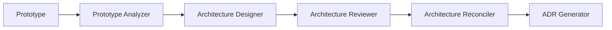
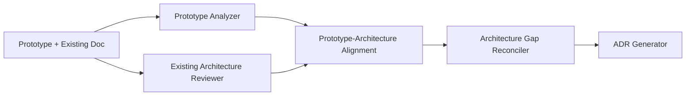
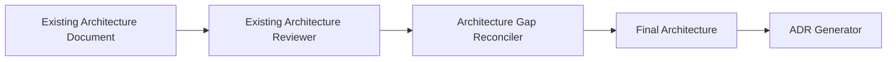
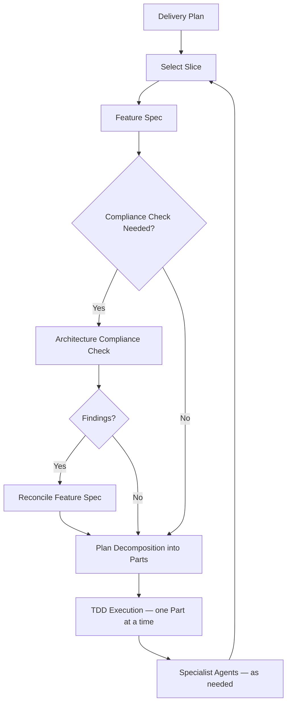

# AI Architecture Toolkit

[](VERSION.md)
[](LICENSE)

A structured, AI-assisted workflow for going from **prototype to production** — covering architecture design, review, delivery planning, decomposition, and TDD execution.

[Overview](#overview) · [Prerequisites](#prerequisites) · [Quick Start](#quick-start) · [Getting Started](#getting-started) · [Workflow](#workflow) · [What's Included](#whats-included) · [Usage](#usage) · [Repository Strategy](#repository-strategy) · [Guides & Examples](#guides--examples) · [Contributing](#contributing)

## Overview

This toolkit provides prompts, agents, templates, workflows, and guides that support a disciplined software delivery process, from early prototyping through production-grade implementation.

It is designed for teams and individuals who:

- Build exploratory prototypes and want to extract validated architecture from them
- Need a repeatable process for architecture design, review, and reconciliation
- Want structured delivery planning with vertical slices and feature specs
- Use TDD-based execution with AI-assisted decomposition
- Rely on specialist AI agents for backend, frontend, QA, DevOps, and more

> [!NOTE]
> This toolkit is workflow-driven. It does not generate code directly — it provides the structured prompts, templates, and guidance that AI coding agents consume to produce consistent, architecture-aligned output.

## Prerequisites

You need an AI coding agent such as GitHub Copilot, Claude, Cursor, or any LLM-based assistant that can read files from your repository. The toolkit provides the prompts and structure — your AI agent does the work.

## Quick Start

> **New to the toolkit?** Read the [Quick-Start Guide](ai/guides/quick-start.md) for a guided walkthrough that takes you from zero to your first vertical slice in 15 minutes. See the [Toolkit Map](ai/guides/toolkit-map.md) for a visual reference of how all components connect.

The shortest path from prototype to implementation. Each step means prompting your AI agent with the referenced prompt file and writing the output to the indicated path.

1. Fill in project context using `ai/templates/project-context-template.md`
2. Prompt with `ai/prompts/prototype-analyzer.md` → `architecture/prototype-analysis.md`
3. Prompt with `ai/prompts/architecture-designer.md` → `architecture/architecture-blueprint.md`
4. Prompt with `ai/prompts/architecture-reviewer.md` → `architecture/review-report.md`
5. Prompt with `ai/prompts/architecture-reconciler.md` → `architecture/architecture-final.md`
6. Prompt with `ai/prompts/adr-generator.md` → `architecture/adr/*.md`
7. Prompt with `ai/prompts/delivery-planner.md` → `architecture/delivery-plan.md`
8. Use `.github/skills/plan-decomposer` → `ai-parts/OVERVIEW.md` and `ai-parts/PXX-*.md`
9. Use `.github/skills/part-executor-tdd` → execute one Part at a time with strict TDD

Implementation begins at **step 9**, after you have both a selected slice
feature spec and `ai-parts/PXX-*.md` files. The delivery plan is the roadmap;
the Part files are the execution-ready handoff.

> [!NOTE]
> Output files (e.g. `architecture/prototype-analysis.md`) are generated by running the prompts — they will not exist until you complete each step.

> [!TIP]
> If you are unsure where to start, run the first three prompts for your entry mode (see [Getting Started](#getting-started)). That will get you oriented quickly.

> [!TIP]
> Looking for the approved plan or the current execution target? Start with
> `architecture/delivery-plan.md`, then move to
> `architecture/feature-specs/<slice-name>.md`, then `ai-parts/OVERVIEW.md`, and
> finally the specific `ai-parts/PXX-*.md` Part you are executing.

## Getting Started

### 1. Choose your entry mode

Your starting point depends on what you already have:

| Mode | You have | Workflow |
|------|----------|----------|
| **A — Prototype Only** | A working prototype, no architecture doc | `ai/workflows/architecture-workflow-prototype-only.md` |
| **B — Prototype + Architecture Doc** | Both a prototype and an existing architecture document | `ai/workflows/architecture-workflow-prototype-plus-architecture-doc.md` |
| **C — Architecture Doc Only** | An architecture document, no prototype | `ai/workflows/architecture-workflow-architecture-doc-only.md` |

Choose the mode based on the strongest available input. If you have an architecture document but are unsure whether it is trustworthy, use Mode B and validate it rather than assuming it is correct.

See `ai/guides/how-to-choose-entry-mode.md` for details.

### 2. Fill in project context

Copy `ai/templates/project-context-template.md` to `ai/project-context.md` and fill it in for your project.

### 3. Follow the workflow

Each entry mode guides you through architecture analysis, review, reconciliation, ADR generation, and delivery planning. Once a delivery plan exists, switch to the **engineering workflow** for implementation.

## Workflow

### Architecture phase

Each entry mode follows a different path to produce the authoritative architecture:

<details>
<summary><b>Mode A — Prototype Only</b></summary>



</details>

<details>
<summary><b>Mode B — Prototype + Existing Architecture Document</b></summary>



</details>

<details>
<summary><b>Mode C — Architecture Document Only</b></summary>



</details>

### Delivery and execution phase

Once the architecture is finalized, all modes converge into the same delivery and execution loop driven by `ai/workflows/engineering-workflow.md`:



Feature specs are not optional documentation. When a feature spec exists for the selected slice, it is the primary input that guides decomposition — more precisely than the broader delivery plan. If a compliance check identifies required corrections, reconcile the feature spec before decomposition.

## What's Included

### Prompts — `ai/prompts/`

Structured prompts for each workflow step:

| Prompt | Purpose |
|--------|---------|
| `prototype-analyzer` | Extract behavior and intent from a prototype |
| `architecture-designer` | Design production architecture |
| `architecture-reviewer` | Review architecture for risks and gaps |
| `architecture-reconciler` | Reconcile reviewer feedback into a final architecture |
| `architecture-gap-reconciler` | Reconcile gaps when starting from an existing doc |
| `existing-architecture-reviewer` | Review a pre-existing architecture document |
| `prototype-architecture-alignment` | Align prototype behavior with architecture doc |
| `adr-generator` | Generate Architecture Decision Records |
| `delivery-planner` | Create a milestone-based delivery plan with vertical slices |
| `feature-spec-generator` | Generate detailed specs for individual slices |
| `feature-spec-reconciler` | Reconcile feature spec feedback |
| `feature-spec-reconciler-quickversion` | Lightweight feature spec reconciliation for smaller changes |
| `architecture-compliance` | Verify implementation aligns with approved architecture |
| `golden-dataset-generator` | Generate test datasets for AI/business logic validation |
| `design-system-generator` | Generate a design system v1 for greenfield UI projects |
| `design-system-from-inventory` | Derive a design system from an existing UI inventory |
| `ui-inventory` | Inventory existing UI surfaces, components, and tokens |
| `ui-compliance-check` | Verify UI implementation conforms to the design system |

### Agents — `ai/agents/`

Specialist AI agents for different concerns:

| Agent | Focus |
|-------|-------|
| `orchestrator-agent` | Coordinates the overall workflow |
| `backend-agent` | Backend implementation |
| `frontend-agent` | Frontend implementation |
| `ai-agent` | AI/ML model integration |
| `qa-agent` | Quality assurance |
| `ai-testing-agent` | AI-specific testing and golden datasets |
| `devops-agent` | CI/CD, infrastructure, deployment |
| `integration-reviewer` | Cross-boundary integration review |

### Skills — `.github/skills/`

Execution-layer skills that bridge planning and code implementation:

| Skill | Purpose |
|-------|---------|
| `plan-decomposer` | Decomposes a delivery plan or feature spec into independently verifiable Parts |
| `part-executor-tdd` | Executes one Part at a time using strict red-green-refactor TDD |

An expert .NET engineering agent is also available at `.github/agents/expert-dotnet-software-engineer.agent.md`.

### Templates — `ai/templates/`

Reusable templates for structured output:

- **Architecture blueprint** — `architecture-blueprint-template.md`
- **ADR** — `adr-template.md`
- **Feature spec** — `feature-spec-template.md`
- **Compliance report** — `compliance-report-template.md`
- **Golden dataset** — `golden-dataset-template.md` / `golden-dataset-json-template.json`
- **Project context** — `project-context-template.md`
- **Design system** — `design-system-template.md`
- **UI inventory** — `ui-inventory-template.md`
- **Retrofit spec** — `retrofit-spec-template.md`

### Workflows — `ai/workflows/`

End-to-end process definitions:

- `architecture-workflow.md` — Full prototype-to-architecture flow
- `architecture-workflow-prototype-only.md` — Mode A
- `architecture-workflow-prototype-plus-architecture-doc.md` — Mode B
- `architecture-workflow-architecture-doc-only.md` — Mode C
- `engineering-workflow.md` — Slice-based implementation with TDD
- `ui-foundation-workflow.md` — Greenfield UI — create design system before delivery planning
- `ui-retrofit-workflow.md` — Retrofit UI — inventory, derive design system, migrate existing slices

### Architecture outputs — `architecture/`

Per-project outputs generated by running the toolkit:

- `architecture-final.md` — Authoritative architecture (source of truth)
- `design-system.md` — Design system (authoritative for UI decisions, when present)
- `ui-inventory.md` — UI inventory (retrofit track input)
- `adr/` — Architecture Decision Records
- `delivery-plan.md` — Milestone and slice plan
- `feature-specs/` — Per-slice feature specifications
- `golden-datasets/` — Test datasets for validation

## Usage

### Using with Copilot

Copilot works best when instructions and architecture files live inside the repo. Use `.github/copilot-instructions.md` to point Copilot at:

- `architecture/architecture-final.md` and `architecture/adr/*.md` as authoritative sources
- Workflows in `ai/workflows/`
- Vertical slice, modular monolith, and TDD expectations

Example prompts:

```text
Follow ai/workflows/engineering-workflow.md.
Use architecture/delivery-plan.md as input.
```

```text
Use ai/agents/backend-agent.md
and implement the backend tasks for the current slice.
```

### Using with Claude or other AI coding agents

Place the toolkit inside or alongside your project repository, then prompt step by step:

```text
Use ai/prompts/prototype-analyzer.md.
Analyze this repository as a prototype.
Treat it as reference behavior, not reference architecture.
Write the result to architecture/prototype-analysis.md.
```

```text
Use ai/prompts/architecture-designer.md
and ai/templates/architecture-blueprint-template.md.
Generate architecture/architecture-blueprint.md.
```

Continue through the workflow steps. For execution, use:

```text
Use .github/skills/plan-decomposer/SKILL.md.
Input: architecture/delivery-plan.md
Output: ai-parts/OVERVIEW.md and ai-parts/PXX-*.md
```

```text
Use .github/skills/part-executor-tdd/SKILL.md.
Execute exactly one Part from ai-parts/.
Follow strict TDD.
```

When needed, ask the agent to adopt a specialist role:

```text
Use ai/agents/backend-agent.md.
Implement the backend tasks for the current slice.
```

## Repository Strategy

The toolkit supports two deployment models.

### Option A — Toolkit inside the project repo

Place the full toolkit in your project repository. Simplest setup for a single project.

```text
project-repo/
├── ai/
├── architecture/
├── .github/
│   ├── skills/
│   ├── agents/
│   └── copilot-instructions.md
├── src/
└── tests/
```

### Option B — Central toolkit repo + per-project repos (recommended)

Keep the master toolkit centrally and maintain one version of prompts, templates, and workflows. Each project repo keeps only its generated outputs and project-specific context. This avoids prompt drift across projects and ensures all teams use the same toolkit version.

**Central toolkit repo:**

```text
ai-architecture-toolkit/
├── ai/          (prompts, templates, workflows, agents, guides, examples)
├── .github/     (skills, agents, instructions)
└── README.md
```

**Per-project repo (minimal):**

```text
project-repo/
├── architecture/          (generated outputs, ADRs, feature specs, golden datasets)
├── ai/project-context.md  (project-specific context)
├── .github/copilot-instructions.md
├── ai-parts/              (decomposition output)
├── src/
└── tests/
```

Keep local overrides in a project repo only when the project needs domain-specific prompt variations, special compliance requirements, or version traceability of exactly which prompt version was used.

## Guides & Examples

### Guides — `ai/guides/`

| Guide | Description |
|-------|-------------|
| `quick-start.md` | Guided walkthrough — zero to first vertical slice in 15 minutes |
| `toolkit-map.md` | Visual map of all toolkit components organized by phase |
| `glossary.md` | Definitions of all load-bearing terms (slice, part, phase, contract, etc.) |
| `vertical-slice-definition.md` | What constitutes a vertical slice, the verticality test, and anti-patterns |
| `modular-monolith-definition.md` | Modular monolith pattern and when to use it |
| `contract-definition.md` | API contract structure and testing guidance |
| `how-to-choose-entry-mode.md` | Decision guide for which workflow to use |
| `how-feature-specs-are-used.md` | How feature specs bridge planning and implementation |
| `definition-of-ready-and-done.md` | Readiness and completion criteria |
| `operating-model.md` | Full operating model across all phases |
| `conversation-summary.md` | Guidance for summarizing conversations |

### UI Design System

The toolkit supports two UI tracks for projects with human-facing interfaces:

| Track | When to Use | Workflow |
|-------|-------------|----------|
| **Greenfield** | New project — create design system from architecture | `ai/workflows/ui-foundation-workflow.md` |
| **Retrofit** | Existing project — derive design system from current UI | `ai/workflows/ui-retrofit-workflow.md` |

Both tracks produce `architecture/design-system.md`, which becomes authoritative for UI decisions. Projects without UI can skip both tracks entirely — all UI-related steps are conditional on the design system file's existence.

### Examples — `ai/examples/`

- `vertical-vs-horizontal-slices.md` — Comparison of slice approaches
- `modular-monolith-patterns.md` — Patterns for modular monolith design
- `contract-patterns.md` — API contract examples
- `feature-spec-driven-slice-flow.md` — Walkthrough of the feature-spec-to-implementation flow
- `example-compliance-report.md` — Sample compliance report
- `example-feature-spec-outline.md` — Sample feature spec outline
- `example-golden-dataset-case.json` — Sample golden dataset case

## Key Concepts

- **Vertical slices** — Every deliverable proves an end-to-end user workflow, not a horizontal layer
- **Modular monolith** — Default architecture pattern unless another is explicitly justified
- **Feature specs** — Bridge between delivery planning and decomposition; one spec per slice
- **Parts** — Smallest independently verifiable unit of work, executed with TDD
- **Architecture compliance** — Continuous verification against approved architecture and ADRs
- **Design system** — Shared visual vocabulary for UI-inclusive projects; optional for non-UI projects
- **Architecture first, planning second, implementation third, review throughout**

## Contributing

Contributions are welcome. If you find a gap, have a suggestion, or want to add a new prompt, agent, or guide:

1. Open an issue describing the change
2. Fork the repository and create a branch
3. Make your changes and submit a pull request

Please keep changes focused — one prompt, one guide, or one template per PR when possible.

## License

This project is licensed under the MIT License — see the [LICENSE](LICENSE) file for details.
